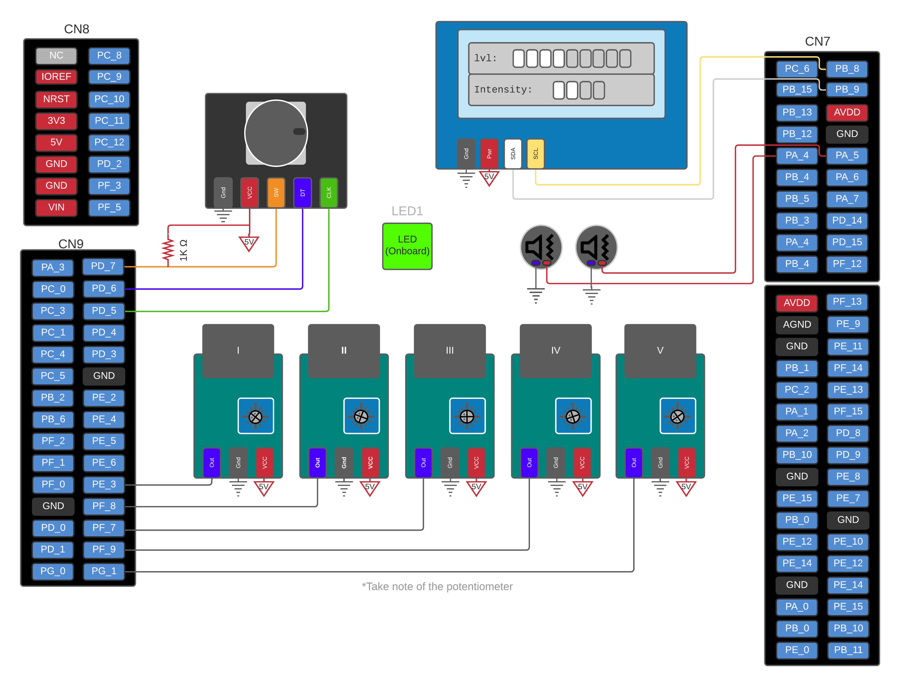

-------------------
About
-------------------

Project Description: 
* This device is an alternative hearing device that can 
help the hearing impaired be more are of their environmental
surroundings. 

Contributor List: Jesse Both


--------------------
Features
--------------------
* 

--------------------
Required Materials
--------------------
- LEDs
- Vibration Motor
- Audio Transducer
- Rotary Encoder

--------------------
Resources and References
--------------------
* [STM32 Nucleo-144 boards](https://www.st.com/resource/en/user_manual/dm00244518-stm32-nucleo144-boards-mb1137-stmicroelectronics.pdf)
* [RM0432](https://www.st.com/resource/en/reference_manual/dm00310109-stm32l4-series-advanced-armbased-32bit-mcus-stmicroelectronics.pdf)

--------------------
Getting Started
--------------------
1. Build the Circuit

2. Build a new project in Mbed Studio
3. Select the Nucleo L4R5ZI as the target
4. Move files into Program
5. Build the program.
6. Speak into the audio transducer.
7. Vibration motor will vibrate and LEDs will illuminate based on sound level.


<br/>

--------------------
CSE321_project3_jessebot_main.cpp:
--------------------
 

----------
Things Declared
----------

```
#define LCD_COLS 16
#define LCD_ROWS 2
#define MAX_LVL 10          // 10 bars for lvl
#define MAX_SEN 4           // 4 bars for intensity
#define BUTTON_DELAY 5      // *50ms
#define SOUND_MULT .5       // sound multipler value
#define ROTARY_CLK GPIOD, 5 // Rotary CLK 
#define ROTARY_DT GPIOD, 6  // Rotary DT
#define ROTARY_SW PD_7      // Rotary SW

#define SOUND_1 GPIOE, 3    // pin for 1st sound transducer
#define SOUND_2 GPIOF, 8    // pin for 2nd sound transducer
#define SOUND_3 GPIOF, 7    // pin for 3rd sound transducer
#define SOUND_4 GPIOF, 9    // pin for 4th sound transducer
#define SOUND_5 GPIOG, 1    // pin for 5th sound transducer

#define VIB_OFFSET 0x3000   // lowest value for vibration
#define VIB_MULT 0x14CC     // (0xFFFF - VIB_OFFSET)/MAX_LVL
```

```
Watchdog - 
Thread - 
Interrupt -
```

----------
API and Built In Elements Used
----------
* mbed.h

----------
Custom Functions
----------


--------------------
CSE321_project2_jessebot_gpio.cpp:
--------------------
This file controls bitwise GPIO manipulation.


----------
Things Declared
----------

```
#define GPIO_INPUT      0x0
#define GPIO_OUTPUT     0x1
#define GPIO_ALTERNATE  0x2
#define GPIO_ANALOG     0x3
```

----------
API and Built In Elements Used
----------
* mbed.h

----------
Custom Functions
----------

* gpio_on(GPIO_TypeDef *GPIO, int pin)
    * Turns gpio pin on based on the input. Manipulates ODR.
* gpio_off(GPIO_TypeDef *GPIO, int pin)
    * Turns gpio pin off based on the input. Manipulates ODR.
* gpio_toggle(GPIO_TypeDef *GPIO, int pin)
    * Turns gpio pin on/off based on the input and current state. Manipulates ODR.
* gpio_check(GPIO_TypeDef *GPIO, int pin)
    * Checks whether or not the IDR is high or not - returns 1 is yes, 0 if no.
* gpio_enable(char *ports)
    * Enables ports based on string input.  'AB' enables ports A and B.
* gpio_moder(GPIO_TypeDef *GPIO, char pin, char set)
    * Enables MODER based on the input.

 <br/>


--------------------
CSE321_project2_jessebot_lib.cpp:
--------------------

----------
Things Declared
----------

N/A

----------
API and Built In Elements Used
----------
* mbed.h

----------
Custom Functions
----------
* string_to_int(char *str)
    * Converts a string to an integer.
* string_length(char *str)
    * Gets the string length.
* string_to_int_wlen(char *str, int len)
    * Converts a string to an integer with a known length.
